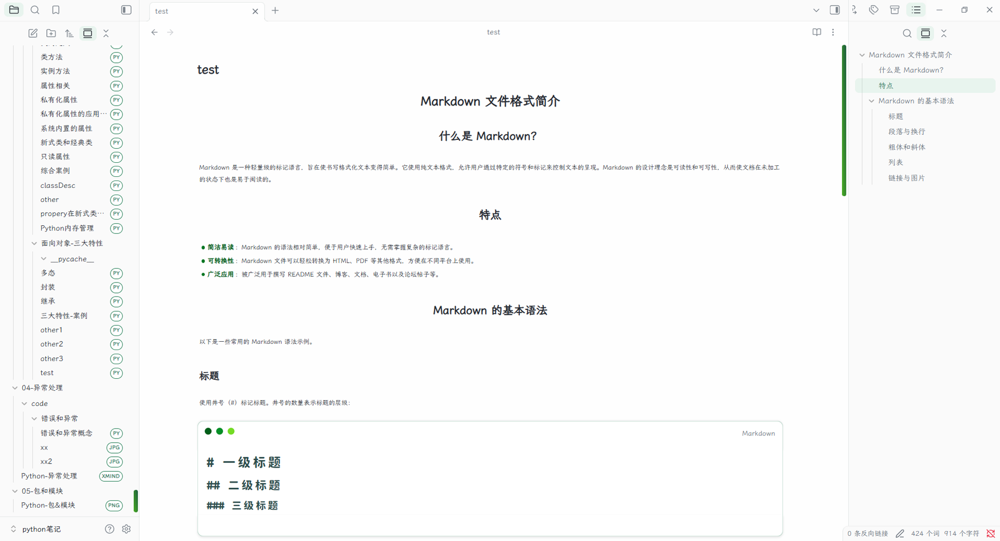

# obsidian-typora-spring-theme
Spring is a theme for [Obsidian](https://obsidian.md/) which is inspired by [typora-spring-theme](https://github.com/SprInec/typora-spring-theme). It only includes Obsidian's editor theme and the general UI; there's no dark mode yet.

## Screenshot

## Install
Community Theme Store (Recommended)
Search Spring in Obsidian community theme store and download it.

## Contributing
Thanks for Issues and PRs!
